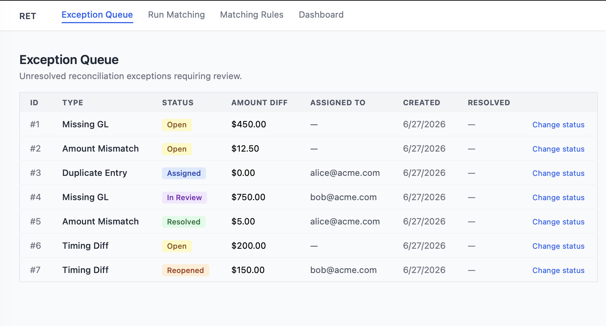

# Reconciliation Exception Tracker (RET)

> Bank-to-GL reconciliation for SME accounting teams. Replaces manual spreadsheet triage with a three-stage matching pipeline (exact → fuzzy → rule-based), a structured exception workflow, and a live reporting dashboard.

<!-- Screenshots: see docs/screenshots/ after running the app locally -->



## What it does

| Capability | Detail |
|---|---|
| **Matching pipeline** | Exact → fuzzy (rapidfuzz) → rule-based, in that order |
| **Exception workflow** | Open → Assigned → In Review → Resolved, with audit log |
| **Matching rules** | Configurable per-tenant tolerances (amount ±$, date ±days) |
| **Reporting dashboard** | Live KPI cards, status breakdown, type breakdown |
| **PDF export** | Print-to-PDF via browser print dialog |
| **Tenant isolation** | Every query scoped to `X-Tenant-ID`; no cross-tenant leakage |
| **Billing** | Stubbed — see [Known stubs](#known-stubs) |

## Tech stack

| Layer | Technology |
|---|---|
| Backend | Python 3.9+, FastAPI, SQLAlchemy |
| Database | SQLite (dev/demo) — swap `db.py` URL for PostgreSQL in production |
| Matching | rapidfuzz |
| Frontend | React 18, Vite, Tailwind CSS |

## Architecture

```
Bank CSV / GL export
        │
        ▼
 POST /matching/run
        │
   ┌────┴──────────────────────────┐
   │  Stage 1: Exact match         │  → confirmed_matches  (no review needed)
   │  Stage 2: Fuzzy match         │  → probable_matches   (human review)
   │  Stage 3: Rule-based match    │  → possible_matches   (explicit approval)
   └───────────────────────────────┘
        │
        ▼
 Exception Queue  ←→  Workflow transitions  ←→  Audit Log
        │
        ▼
 Reporting Dashboard  →  PDF export
```

## Quick start

**Prerequisites:** Python 3.9+, Node.js 18+

### Backend

```bash
cd backend
python -m venv .venv
source .venv/bin/activate        # Windows: .venv\Scripts\activate
pip install -r requirements.txt
python seed_demo.py              # creates ret.db with demo data
uvicorn app.main:app --reload
```

API: **http://localhost:8000**  
Swagger UI: **http://localhost:8000/docs**

### Frontend

```bash
cd frontend
npm install
npm run dev
```

UI: **http://localhost:5173**

## Demo walkthrough

With both servers running, open **http://localhost:5173**.

1. **Exception Queue** — 7 seeded exceptions across all workflow statuses. Click "Change status" to transition any exception; the state machine enforces valid transitions.

2. **Run Matching** — Pre-filled demo JSON shows the three matching stages. Click "Run pipeline" to see confirmed / probable / possible matches with confidence scores. Edit the bank or GL JSON to test your own data.

3. **Matching Rules** — 3 pre-seeded rules. Create, edit, or delete rules; active rules are applied in the pipeline's rule-based stage.

4. **Dashboard** — Live KPI summary of all exceptions. Click "Export PDF" to generate a report via the browser print dialog.

## API reference

| Method | Path | Description |
|---|---|---|
| GET | `/health` | Liveness check |
| GET | `/exceptions` | List exceptions (tenant-scoped) |
| POST | `/exceptions/{id}/transition` | Transition exception status |
| POST | `/matching/exact` | Exact-only match |
| POST | `/matching/run` | Full 3-stage pipeline |
| GET | `/rules` | List matching rules |
| POST | `/rules` | Create rule |
| PUT | `/rules/{id}` | Update rule |
| DELETE | `/rules/{id}` | Delete rule |
| GET | `/reporting/summary` | Aggregated KPIs (tenant-scoped) |
| GET | `/billing/plan` | Billing info (stub) |

All endpoints read `X-Tenant-ID` header (defaults to `"dev"`).

## Running tests

```bash
cd backend
python -m pytest tests/ -q
# 81 tests, ~0.4 s
```

## Project structure

```
backend/
  app/
    api/           # route handlers — logic lives in services/
    models/        # SQLAlchemy models
    services/      # matching engine, fuzzy, rules, pipeline, exceptions
  tests/           # 81 unit + integration tests
  seed_demo.py     # idempotent demo data seeder
  requirements.txt

frontend/
  src/
    api/           # fetch wrappers per domain
    components/    # RuleForm, RuleList
    pages/         # ExceptionQueue, MatchingRun, Dashboard
  vite.config.js   # dev proxy → localhost:8000
```

## Screenshots

| Page | File |
|---|---|
| Exception Queue (with status badges + Change status button) | `docs/screenshots/exception-queue.png` |
| Run Matching — results showing confirmed / probable / possible tiers | `docs/screenshots/matching-results.png` |
| Dashboard — KPI cards + status bar chart | `docs/screenshots/dashboard.png` |
| Matching Rules — list with edit/delete actions | `docs/screenshots/rules.png` |

**To capture:** start both servers (`uvicorn` + `npm run dev`), run `python seed_demo.py` from `backend/`, open `http://localhost:5173`, and screenshot each page at 1440px width. Save into `docs/screenshots/`.

## Known stubs

| Area | Status | Notes |
|---|---|---|
| **Billing** | Stub | `GET /billing/plan` returns hardcoded demo values. Marked `# STRIPE_STUB` in `backend/app/api/billing.py`. |
| **Auth** | Dev placeholder | `X-Tenant-ID` is trusted as-is. Replace with JWT extraction before production. UI always sends `"dev"`. |
| **Database** | SQLite | Change `SQLALCHEMY_DATABASE_URL` in `backend/app/db.py` to a PostgreSQL URL for production. |
| **File ingestion** | Not implemented | Pipeline accepts JSON via API. CSV upload is a natural next step. |
